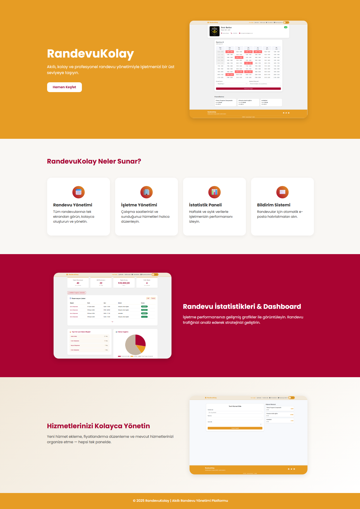
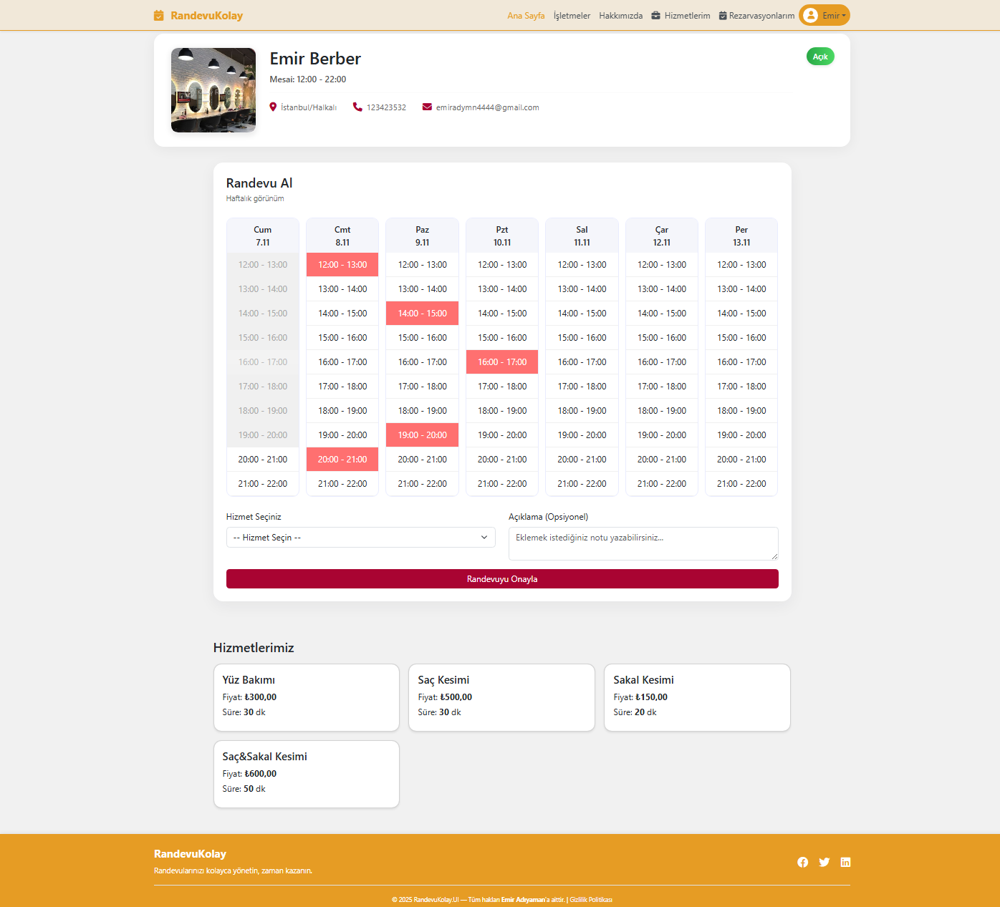
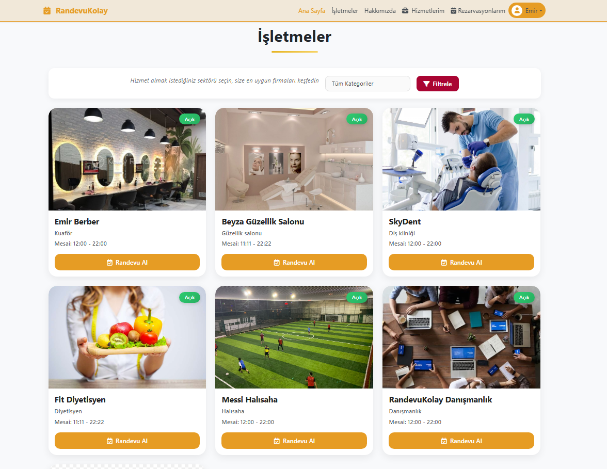
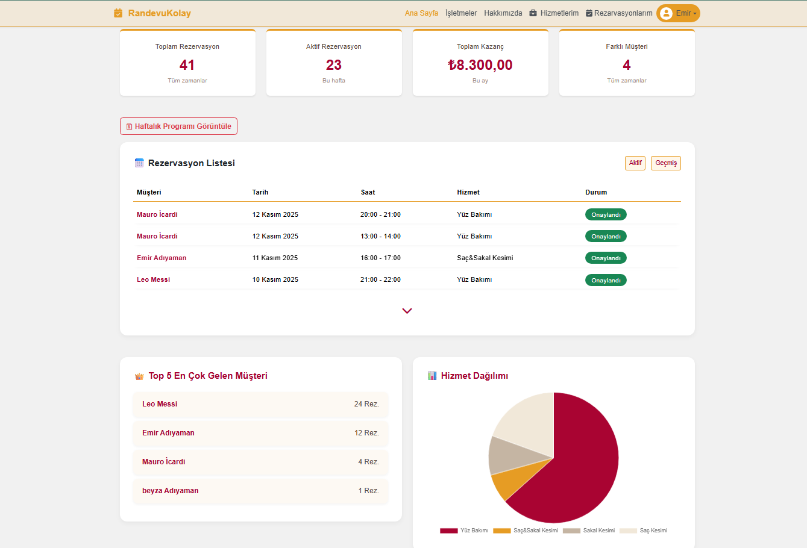
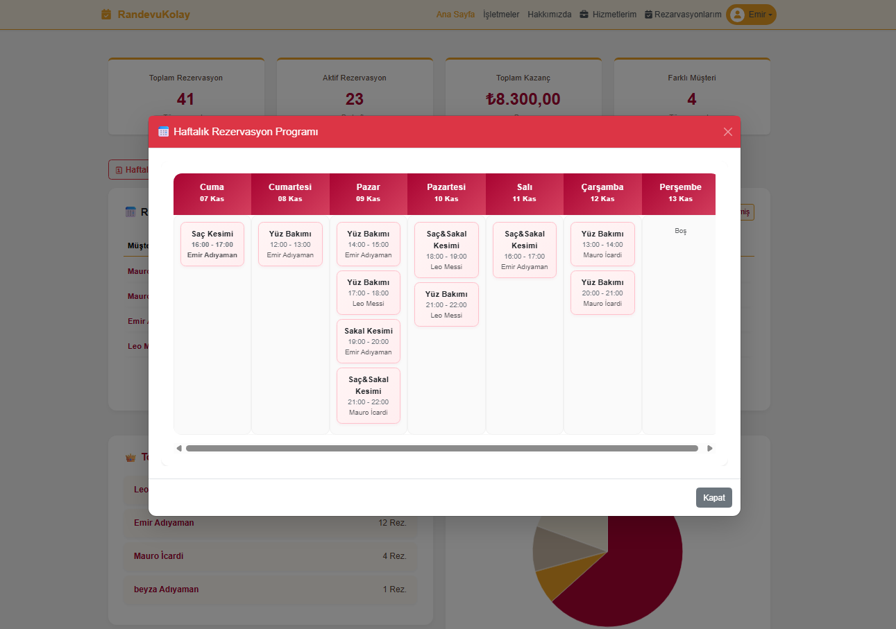
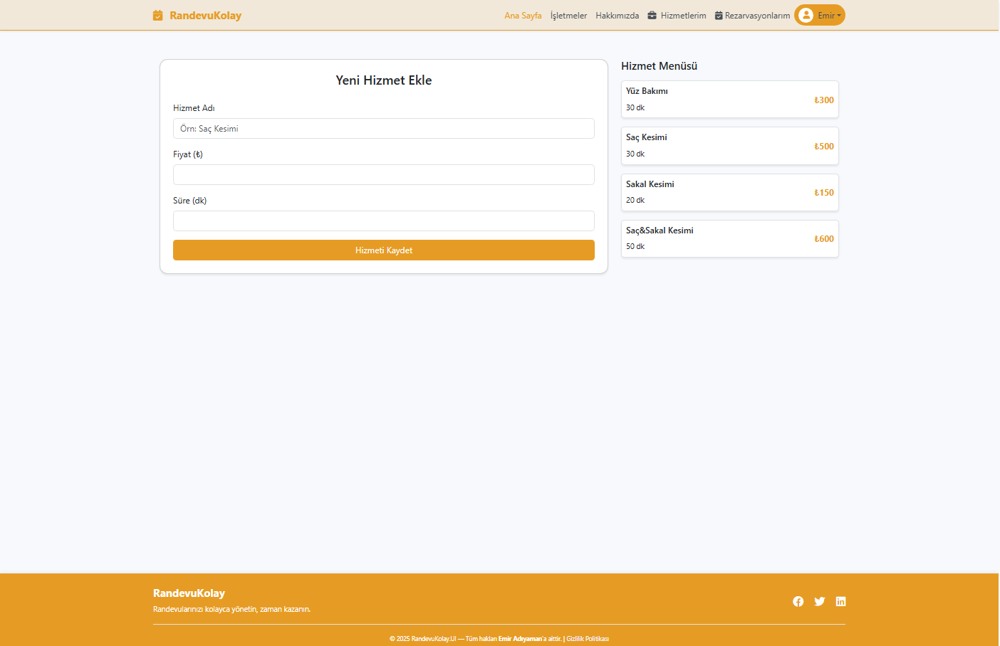
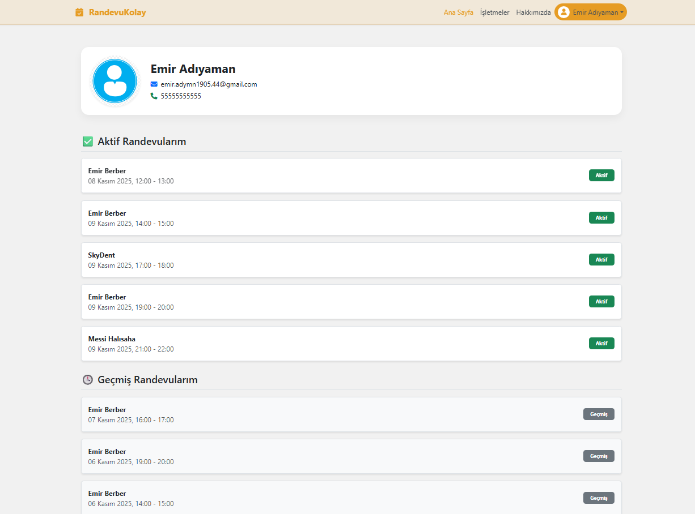
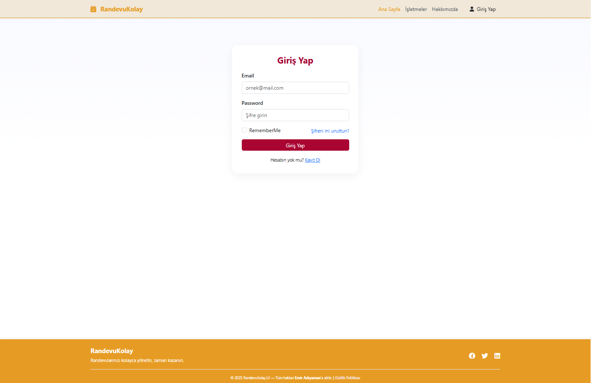
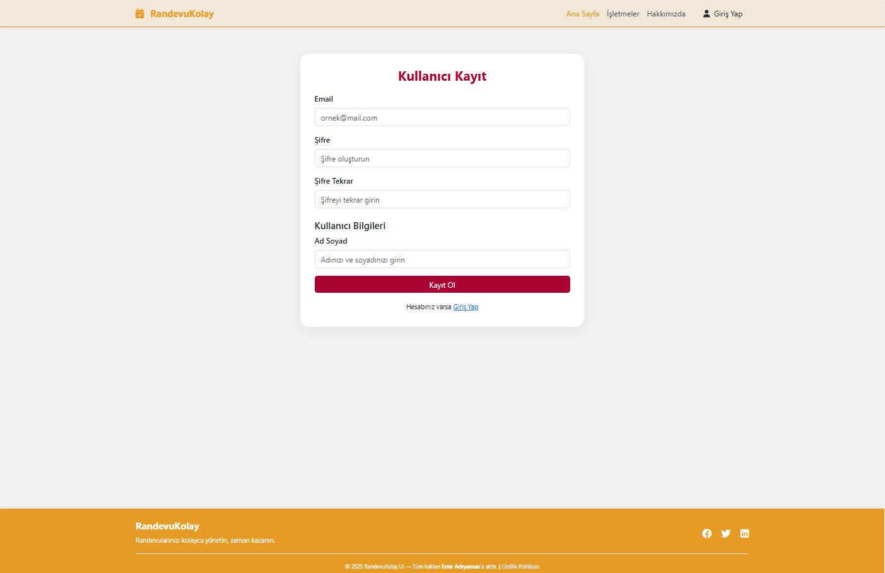
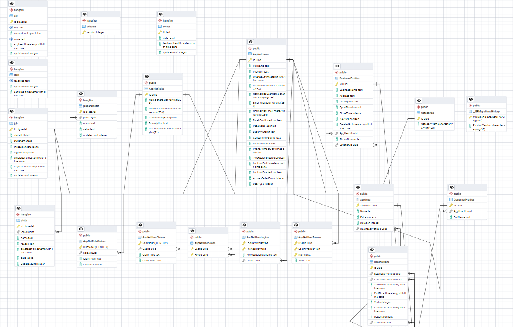

# 🗓️ RandevuKolayDemo — Akıllı Randevu Yönetim Sistemi (.NET 8)

**RandevuKolay**, işletmelerin randevu oluşturma ve yönetim süreçlerini dijitalleştirmek için geliştirilen modern bir rezervasyon platformudur.  
Proje, **Clean Architecture** prensipleriyle inşa edilmiş olup, **.NET 8** altyapısı, **Entity Framework Core**, **PostgreSQL**, **Hangfire**, **MailKit**, **Identity**, **JWT** ve **FluentValidation** teknolojilerini bir araya getirir.

---

## 🚀 Öne Çıkan Özellikler

- 🔐 **Kimlik Doğrulama & JWT Yetkilendirme**
  - ASP.NET Core Identity ve JWT tabanlı giriş-çıkış işlemleri.
- 🏢 **İşletme Yönetimi**
  - Sektöre göre filtreleme (örnek: kuaför, klinik, tamirhane vb.)
  - Çalışma saatlerini ve hizmetleri yönetme.
- 💇‍♀️ **Hizmet Modülü**
  - Hizmet ekleme (isim, ücret, süre).
  - İşletmeye özel hizmet listesi.
- 📅 **Rezervasyon Yönetimi**
  - Haftalık rezervasyon takvimi görüntüleme.
  - Günlük mesai başlangıcında işletmelere e-posta hatırlatması.
  - Randevu oluşturma, iptal etme, geçmiş görüntüleme.
- ✉️ **Mail Hatırlatma Sistemi**
  - Hangfire ve MailKit ile arka planda otomatik e-posta gönderimi.
- 📊 **Dashboard & Analitik**
  - Chart.js ile haftalık/aylık rezervasyon grafikleri.
- 🧩 **Modern Mimarî**
  - Clean Architecture + Repository Pattern + FluentValidation + AutoMapper.

---

## 🧰 Teknoloji Yığını

### 🔹 Backend
- **.NET 8 Web API**
- **Entity Framework Core 8**
- **PostgreSQL**
- **Hangfire** (Background Job Scheduler)
- **MailKit** (SMTP E-posta Servisi)
- **FluentValidation**
- **AutoMapper**
- **ASP.NET Core Identity**
- **JWT Authentication**

### 🔹 Frontend
- **ASP.NET Core MVC / Razor Pages**
- **Bootstrap 5**
- **Chart.js** (Dashboard grafikler)
- **jQuery + AJAX**

### 🔹 Araçlar
- **Swagger** – API test ve dokümantasyon  
- **Hangfire Dashboard** – Görev kontrol paneli  
- **Postman** – API test aracı  
- **Visual Studio 2022 / Rider**  
- **Git & GitHub**

---

## 🧱 Clean Architecture Katmanları

Proje **Clean Architecture** mimarisine göre yapılandırılmıştır.  
Bu yapı, bağımlılıkları minimuma indirir, test edilebilirliği artırır ve uzun vadede sürdürülebilir kod tabanı oluşturur.
### 🧩 Clean Architecture Katmanları

| Katman | Açıklama |
|--------|-----------|
| **Domain** | Temel iş kuralları, entity’ler ve interface tanımları bulunur. |
| **Application** | Use case’ler, servisler, DTO’lar ve CQRS yapısı yer alır. |
| **Infrastructure** | Veritabanı erişimi, dış servis entegrasyonları (MailKit, Hangfire) bulunur. |
| **API** | Web API katmanı, controller yapısı ve endpoint yönetimi. |
| **UI (MVC)** | Razor tabanlı kullanıcı arayüzü, Dashboard ve görsel yönetim katmanı. |

---
## 📸 Uygulama Görselleri

RandevuKolay arayüzü, kullanıcı dostu ve modern bir tasarıma sahiptir.  
Aşağıda uygulamanın farklı bölümlerine ait ekran görüntülerini inceleyebilirsiniz 👇  

---
### 🏠 Ana Sayfa  
Kullanıcıların hizmet ve işletme bilgilerine kolayca ulaşabildiği modern açılış ekranı.  

---

### 🏢 İşletme Detay Sayfası  
İşletmeye ait hizmet, iletişim bilgisi ve randevu oluşturma ekranı.  

---

### 🗂️ İşletmeler Sayfası  
Tüm işletmelerin listelendiği, sektör filtrelemesi yapılabilen sayfa.  

---

### 📊 Rezervasyon Dashboard  
Chart.js grafikleriyle zenginleştirilmiş haftalık ve aylık rezervasyon analiz ekranı.  

---

### 📅 Haftalık Randevu Programı  
İşletmelerin haftalık randevularını görüntüleyebildiği dinamik takvim ekranı.  

---

### 💇‍♀️ İşletmeye Özel Hizmet Ekleme  
İşletmelerin sundukları hizmetleri (ücret, süre, açıklama) ekleyebildiği sayfa.  

---

### 👤 Kullanıcı Profili  
Kullanıcıların geçmiş randevularını ve kişisel bilgilerini görüntüleyebildiği alan.  

---

### 🔐 Giriş (Login) Sayfası  
Kimlik doğrulama işlemleri için modern ve responsive giriş ekranı.  

---

### 📝 Kullanıcı Kayıt Sayfası  
Yeni kullanıcıların kolayca hesap oluşturabildiği kayıt ekranı.  

---

### 🏢 İşletme Kayıt Sayfası  
İşletmelerin kayıt olurken sektör, hizmet türü ve çalışma bilgilerini ekleyebildiği sayfa.  

---

### 🗄️ Veritabanı Diyagramı  
Clean Architecture yapısına uygun olarak oluşturulan PostgreSQL veritabanı ilişkileri.  

---

## 🚀 Yakında Hizmete Geçecek

**RandevuKolay**, küçük işletmelerin randevu süreçlerini dijitalleştirerek operasyonel verimliliği artırmayı hedefleyen modern bir rezervasyon platformudur.  
Bu repo, **Emir Adıyaman** tarafından geliştirilen **RandevuKolayDemo** uygulamasını tanıtmaktadır.  

📢 **Canlı sürüm** yayınlandığında, bu sayfada veya ilgili canlı repoda bağlantı paylaşılacaktır.  
Her türlü geri bildirim ve iş birliği teklifleri için [emiradymn.com.tr](https://emiradymn.com.tr) adresinden iletişime geçebilirsiniz.  

✨ **Yakında hizmete geçmesi dileğiyle...**

---
🧾 **Lisans ve Telif Hakkı**

Tüm hakları saklıdır.  
© 2025 **Emir Adıyaman** — Bu proje, Emir Adıyaman tarafından geliştirilmiştir.  
Projenin tasarımı, mimarisi ve içeriği üzerinde tüm fikri ve sınai mülkiyet hakları geliştiriciye aittir.  
İzinsiz kopyalanamaz, çoğaltılamaz veya dağıtılamaz.

